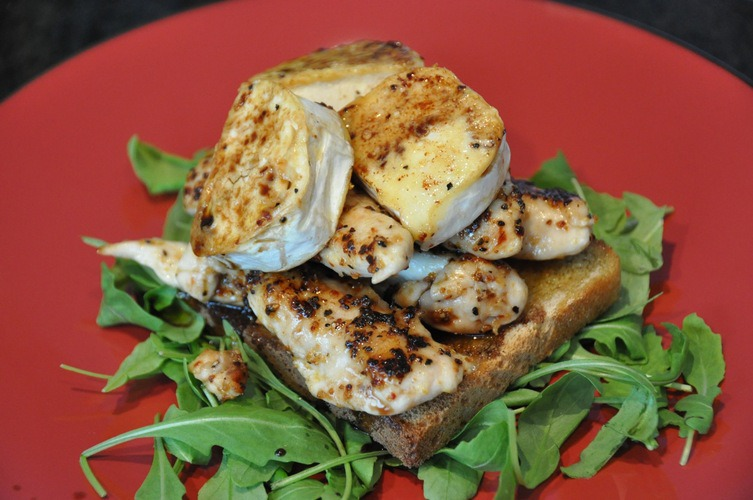

# Chevre Chaud with Chicken

This is a very easy recipe, tastes great and is quick to make.

## Ingredients

4 persons.

+ 2 chicken breasts
+ 200 g soft chevre cheese
+ 2 pcs toast bread
+ 100 g Rucola salad
+ honey
+ Balsamico
+ olive oil
+ black pepper
+ salt

## Preparation

Prepare all ingredients before starting. If you use chicken filets instead of breast, it will be slightly quicker.

30 minutes.

1. Fry the chicken in a frying pan in olive oil.
2. Cut the cheese into 2cm thick slices.
3. Add the cheese into the frying pan so they have 5 minutes to get soft and nice color.
4. Salt and pepper the chicken.
5. Toast the bread.
6. Put the rucola salad on a plate.
7. Put the toasted break on top of the rucola salad.
8. Take out the chicken from the frying pan and cut into long slices.
9. Put the chicken on top of the bread.
10. Now the cheese should be soft and have a nice color, so put the pieces on the chicken.
11. Pour a bit balsamico and olive oil on over the cheese.
12. Adding a bit fluid honey as the final bit on top is delicious.

Serve immediately.
