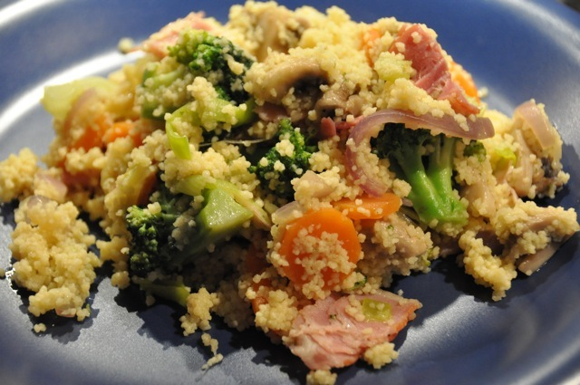

# Couscous with Vegetables and Bacon

## Ingredients

4 persons.

+ 200 g Broccoli
+ 3 carrots
+ 1 leek
+ 1 red onion
+ 250 g bacon
+ 250 ml water
+ 1 vegetable bouillon
+ 1 chicken bouillon
+ 250 g couscous
+ oil
+ 150 g mushrooms

## Preparation

30 minutes.

1. Wash and chop broccoli, carrots, leek and red onion.
2. Cut the bacon in 1-2 cm pieces.
3. Clean and cut the mushrooms in four.
4. Heat the oil in a frying pan.
5. Fry the broccoli, carrots, leek, red onions and bacon. Start with the broccoli, because it needs most time to get soft. Then add carrots, then the other ingredients. Mix from time to time when frying.
6. Heat water and add the bouillon.
7. Put couscous in a pot and add hot water and let swell for 5 minutes. It depends which type of Couscous you have how long it needs to swell, so check the package for details.
8. Mix couscous with the carrots, leek, red onions and bacon.
