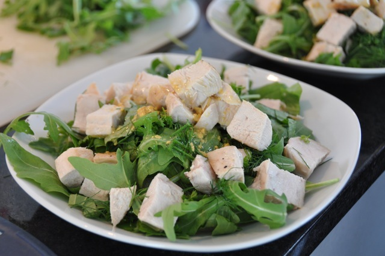

# Glass Noodle Salat with Chicken

Found this recipe in a Migros magazine and wanted to try it. I was very surprised how good this tastes. It's a perfect lunch a warm summer day when you sit in the sun on the balcony.

## Ingredients

+ 300 g chicken breasts
+ 50 g Rucola salad
+ 0.5 bunch Parsley
+ 0.5 bunch Basil
+ 0.5 bunch Dill
+ 2 tbsp rice vinegar
+ 50 g glass noodles
+ 1 tbsp mustard
+ 1 tbsp olive oil

## Preparation

1. Cut the glass noodles with scissors into approximately 15 cm pieces.
2. Boil the water for the noodles. Add the noodles when the water boils. Turn off the heat and let the noodles in the water for 1-2 minutes. Take out and place the noodles on paper to dry.
3. Chop the herbs.
4. Mix the rice vinegar, olive oil and the mustard.
5. Cut the chicken breasts in cubes.
6. Fry the meat in olive oil. Spice with salt and pepper.
7. Put the noodles, herbs and the Rucola salad mixed on plates.
8. Add the chicken meat on top.
9. Pour over the sauce.
