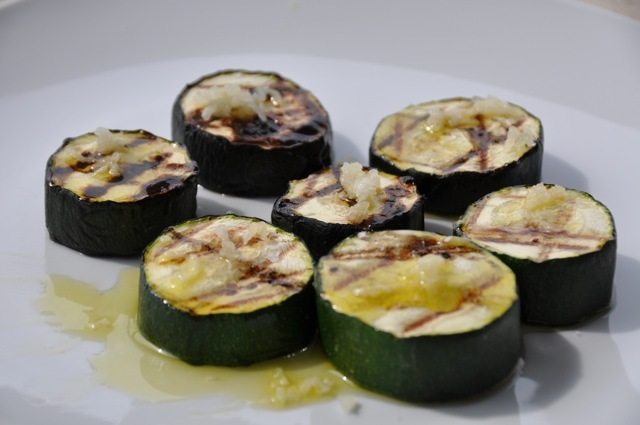

# Grilled Zuccetti with Garlic

Summer favorite from my mother. Especially good as a side dish when grilling. Tastes great with meat.

## Ingredients

+ 2 pcs Zuccetti
+ olive oil
+ garlic
+ course salt

## Preparation

1. Wash and cut the Zuccetti in 2 cm thick pieces.
2. Grill the Zuccetti slices until the are getting color. No need to turn more than once, so grill until getting a nice black color. Takes approximately 10-15 minutes depending on heat.
3. Put the grilled Zuccetti on a plate. Top with olive oil, salt and pressed garlic.
