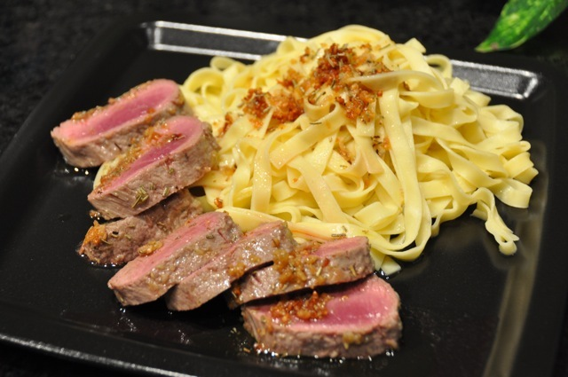

# Lamb with Garlic and Rosemary

Simple and tasting very good. Anyone will love this!

## Ingredients

+ 250 g lamb loin
+ garlic
+ Rosemary
+ butter
+ olive oil
+ salt
+ black pepper
+ 250 g fresh Tagliatelle pasta

## Preparation

1. Heat a frying-pan with butter and oil. Add enough butter and oil so that the mean will have something to swim in.
2. Add Rosemary and press garlic into the melted butter and oil. Use at least three cloves of garlic.
3. Boil the water for pasta. Add salt.
4. Fry meat when pan is hot. Take care that the garlic is not getting burnt. Use a spoon to pour the garlic oil over the meat while frying to give a nice taste.
5. Remove frying-pan from heat when the meat has got color. The idea is to fry the meat for a while to get a nice color and then reduce the heat and let it get tender. One can put a lid on the pan to keep the heat. The meat should be pink inside.
6. Add pasta to boiling water. Follow the instructions on the package. Usually the fresh pasta is ready in a few minutes.
7. Cut the meat into nice slices. Serve immediately.
