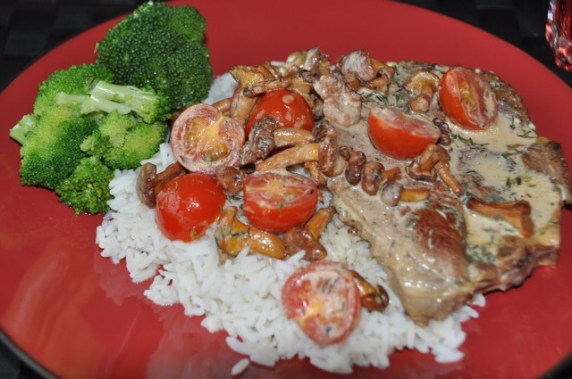

# Pork and Chantarelles in Creamy Sauce

This recipe is based on something I found online. Very, very tasty, but maybe not something you'd eat every day.

## Ingredients

+ 400 g pork filet
+ 50 g chantarelles
+ 10 cherry tomatoes
+ 2 dl creme fraise
+ 1 tbsp fond of chantarelles
+ 1 tbsp Thyme
+ Broccoli
+ 4 dl rice

## Preparation

1. Heat water and boil the rice according to the package instructions.
2. Wash and boil the broccoli.
3. Cut the meat in 2 cm thick slices.
4. Heat a frying-pan and fry the meat with the chantarelles. Fry until the meat has got a golden brown color.
5. Wash and cut the cherry tomatoes. Add them into the pan.
6. Pour the creme fraise into the pan. Stir and let simmer a few minutes.
7. Top with Thyme before serving. Serve with rice and Broccoli.
