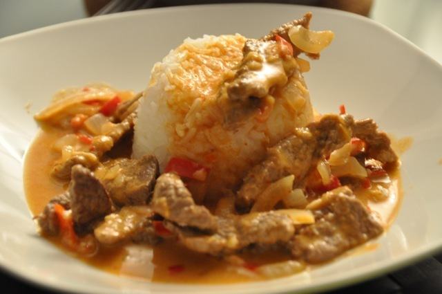

# Red Thai Curry

## Ingredients

4 persons.

+ 500 g beef meat
+ 2 tbsp sesame oil
+ 1 onion
+ 4 tbsp red Thai chili paste
+ 3 red chilis
+ 2 cloves garlic
+ 1 beef bouillon
+ 1 dl water
+ 4 dl coconut cream
+ 1 tbsp Oyster sauce
+ 2 tbsp fish oil (Nam Pla)
+ 2 tbsp lime juice
+ 4 dl parfume rice

## Preparation

30 minutes.

1. Boil rice according to the instructions on the package.
2. Cur the meat in pieces.
3. Heat a frying-pan and fry the meat. Fry until the meat gets a nice color. Take out the meat and put it aside in a bowl.
4. Heat the oil in a frying-pan.
5. Add the chili paste into the pan. Fry on low heat until it starts to smell nicely.
6. Chop the onion and the red chilis in small pieces. Add into the pan.
7. Press the garlic into the pan.
8. Heat 1 dl water and let the bouillon dissolve. Add into the pan as well.
9. Add the fried meat and the coconut cream into the pan. Let simmer a few minutes while gently stirring.
10. Before it's ready add the fish oil, oyster sauce and the lime juice. Serve with the parfume rice in a deep plate. Optionally top with Thai Basil leaves.
